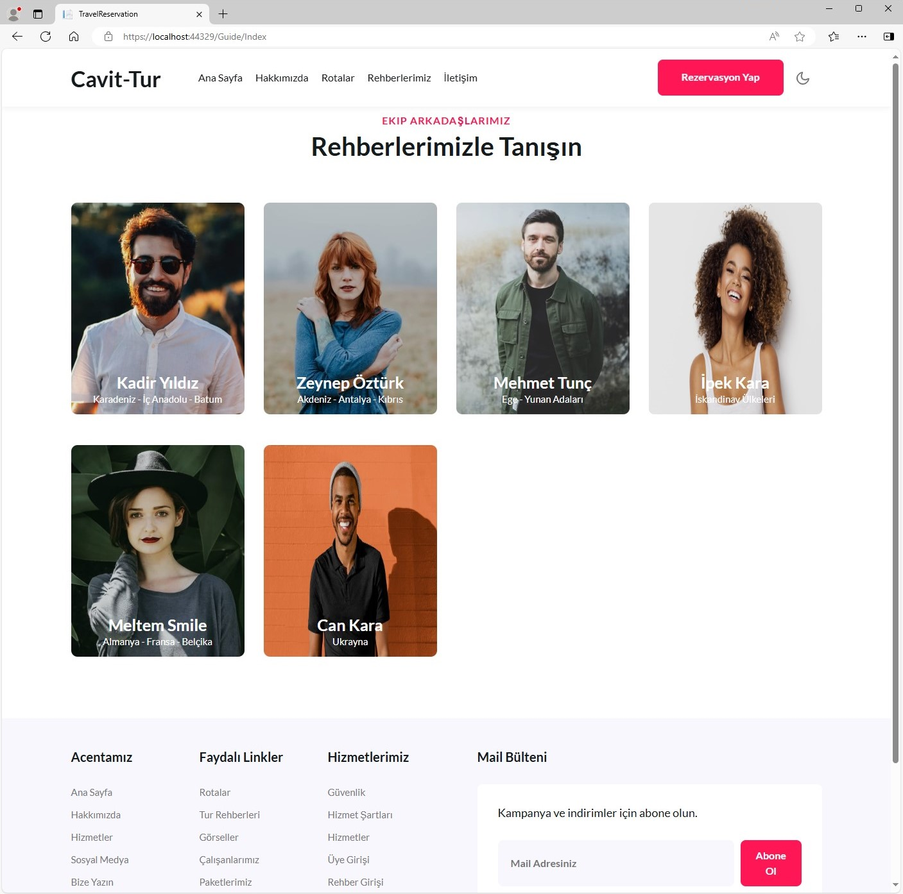
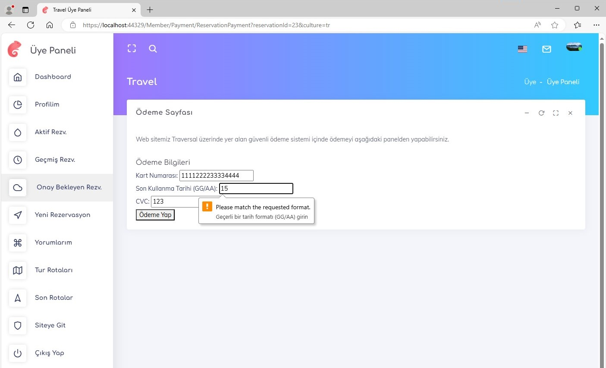

<h1 align="center">Travel Reservation</h1>

Bu proje, bir tur acentesinin web isteğinin tümünü karşılayabilecek şekilde tasarlanmıştır. Kullanıcılar, bir tura rezervasyon yapmak istediklerinde kayıt olmalı, turlar hakkında blog yazılarını inceleyip bu yazılara yorum yapabilmektedir. Admin panelinde ise Excel ve PDF raporlarıyla geçmiş ve gelecek tüm rezervasyonlara erişim sağlanmaktadır. Kullanıcılar, şifrelerini unuttuklarında e-posta ile şifrelerini sıfırlayabilmektedir. Proje, birçok ek özellik barındırmaktadır.

<h2 align="center">Kullanılan Teknolojiler</h2>

### Framework
<ul>
    <li><strong>Entity Framework 8.0</strong></li>
</ul>

### İletişim ve Protokoller
<ul>
    <li><strong>SMTP Mail</strong></li>
    <li><strong>SignalR</strong></li>
</ul>

### Veritabanları
<ul>
    <li><strong>MSSQL</strong></li>
    <li><strong>PostgreSQL</strong></li>
</ul>

### Veri Yönetimi
<ul>
    <li><strong>Raporlama</strong></li>
    <li><strong>Loglama</strong></li>
</ul>

### Web Teknolojileri
<ul>
    <li><strong>AJAX</strong></li>
    <li><strong>HTML / CSS</strong></li>
    <li><strong>JavaScript</strong></li>
</ul>

### Kimlik Yönetimi ve Güvenlik
<ul>
    <li><strong>Identity</strong></li>
    <li><strong>JWT (JSON Web Token)</strong></li>
    <li><strong>Web API</strong></li>
</ul>

<h2 align="center">Mimari Desenler</h2>
<ul>
    <li><strong>CQRS (Command Query Responsibility Segregation)</strong></li>
    <li><strong>Mediator</strong></li>
    <li><strong>Repository Pattern</strong></li>
</ul>

<h2 align="center">Proje Görselleri</h2>

